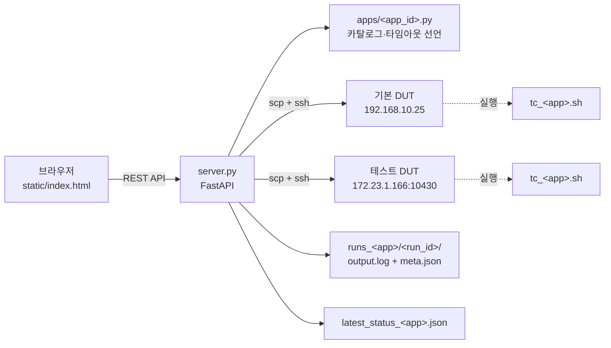
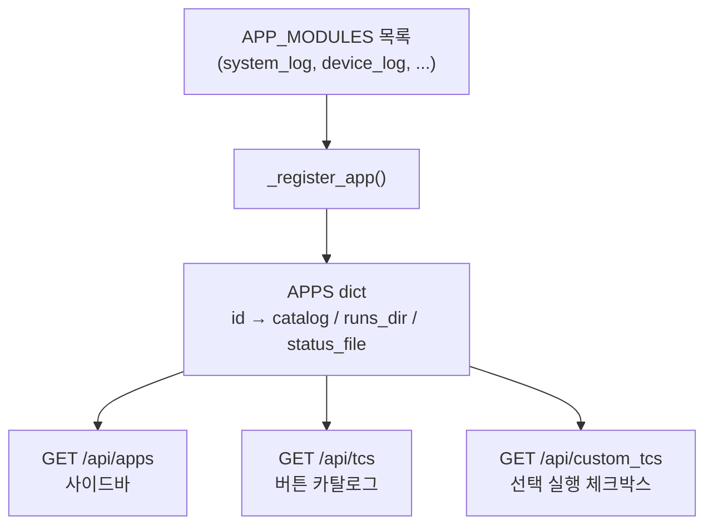
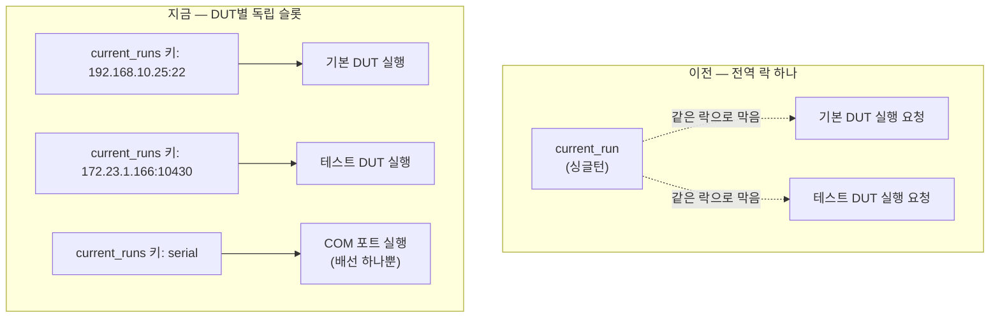
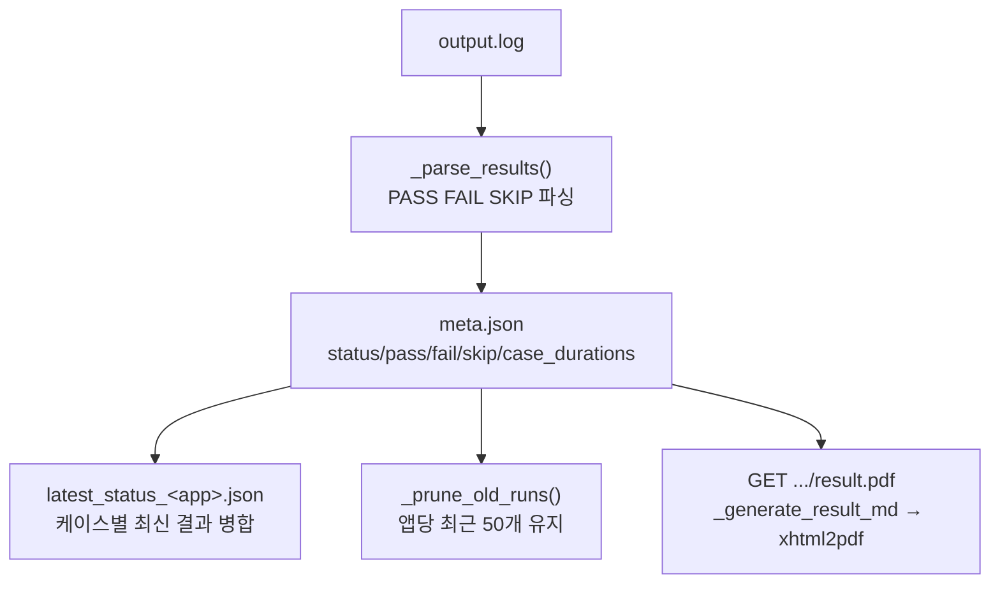

# tc_dashboard 아키텍처

`tools/tc_dashboard/`의 내부 동작 원리를 코드 기준으로 정리한다. 사용법은 [dashboard_guide.md](dashboard_guide.md), 설치는 [install.md](install.md) 참고.

## 구성 요소

```
tools/tc_dashboard/
├── server.py              FastAPI 백엔드 — 앱 레지스트리, 실행 오케스트레이션, 결과 파싱/PDF
├── apps/<app_id>.py        앱별 카탈로그(버튼 목록)·타임아웃·재부팅 체인 선언
├── static/index.html       프론트엔드 전부(HTML+CSS+JS, 단일 파일)
├── runs_<app>/<run_id>/     run별 output.log + meta.json (+ sl_journal.log)
└── latest_status_<app>.json  케이스(TCxx-n)별 "가장 최근 결과" 스냅샷

tcs/<app_id>/tc_<app_id>.sh  실제 TC 스크립트 (DUT로 scp되어 그 자리에서 실행됨)
config.env / secrets.env     DUT_HOST/PORT, SSH 키 경로, FACTORY_AUTH_* 등
```

새 앱을 추가하려면 `apps/<name>.py`를 만들고 `server.py`의 `APP_MODULES`에 등록하면 된다 — `_register_app()`이 자동으로 `APPS` 딕셔너리에 얹고 프론트 사이드바에 나타난다.



## 앱 등록 / 선택

`apps/<app_id>.py`는 `CATALOG`(버튼 목록), `CUSTOM_TC_TIMEOUTS`(선택 실행용), `REBOOT_TC_MAP`(재부팅 TC의 -pre/-post 쌍) 등을 선언만 하고, `server.py`가 이걸 읽어 `APPS` 딕셔너리로 등록한다. 프론트는 앱을 바꿀 때마다 카탈로그/이력/현황판을 그 앱 기준으로 다시 불러온다 — **앱 선택 자체는 실행 동시성과 무관**하며, 실제 락은 항상 DUT/채널 단위로 걸린다(아래 참고).



## 실행 흐름

카탈로그의 각 버튼은 `{id, label, flag, timeout, reboot, chain_reboot_pairs?}` 형태의 entry다. "빠른 실행"은 `flag=None`(인자 없이 기본 세트), "전체 실행"은 `flag="--full"` + 재부팅 체인, "선택 실행"(`tc_id="custom"`)은 체크된 TC 목록으로 `--only` 플래그를 그 자리에서 조립한다. `POST /api/run`은 실행이 끝나길 기다리지 않고 `run_id`만 즉시 돌려주고, 실제 실행은 `asyncio.create_task`로 백그라운드에서 진행된다 — `dut_preset_id`로 어느 DUT를 쓸지 정하고, 그 DUT의 슬롯이 비어있어야 시작된다(자세한 건 바로 아래 DUT 슬롯 참고). 재부팅이 없는 TC는 `_run_ssh()`(scp+ssh 한 번), 재부팅이 있는 TC는 `_run_ssh_full_with_reboots()`(pre 실행 → 재부팅 대기 → post 실행), 시리얼 채널은 `_run_serial()`(COM 포트 직접 제어, SSH 미사용)로 나뉜다.


## DUT별 독립 실행 슬롯 (동시성 모델)

과거에는 "DUT가 물리적으로 하나뿐"이라는 가정으로 전역 락(`current_run`) 하나가 앱이 달라도 동시 실행을 막았다. 지금은 DUT가 두 대(기본 `192.168.10.25`, 테스트 `172.23.1.166:10430`)라 락을 DUT 단위(`current_runs["<host>:<port>"]`)로 쪼갰다 — 시리얼은 COM 포트가 물리적으로 하나뿐이라 고정 키 `"serial"` 하나를 공유한다. `dut_key`가 다르면 서로 절대 안 막는다: 기본 DUT에서 run이 도는 중에도 테스트 DUT로의 `POST /api/run`은 새 슬롯을 얻어 즉시 시작되고, 같은 DUT를 대상으로 한 두 번째 요청만 첫 번째가 끝날 때까지 409로 거부된다. 이전엔 `DUT_HOST`/`DUT_PORT` 전역 변수를 런타임에 바꿔치기했지만, 지금은 그 자체가 없다 — 모든 실행 요청이 자기가 쓸 DUT를 매번 명시(`dut_preset_id`)하고, SSH 관련 함수 전체가 `dut` 파라미터를 받아 그대로 쓴다(ControlMaster 소켓도 `ssh_control_<host>_<port>.sock`로 DUT별 분리).



`GET /api/dut`는 프리셋 목록과 각 프리셋의 `running` 여부를 내려준다 — 프론트는 이걸로 **선택된 DUT가 지금 바쁜지**만 보고 Run 버튼을 잠근다(다른 DUT가 바빠도 무관). DUT 셀렉트박스 자체는 절대 비활성화되지 않는다.

## 결과 처리

TC 스크립트는 stdout에 `[PASS|FAIL|SKIP] TCxx-n: <설명>` 라인을 찍고, `_parse_results()`가 이를 파싱해 case_id별 결과 맵을 만든다. run 종료 후 `run_tc()`가 `meta.json`(run_id, dut_host/port, status, pass/fail/skip, case_durations 등)을 쓰고, 완료된 run은 `latest_status_<app>.json`(케이스별 "가장 최근 결과" 스냅샷, 결과현황판의 소스)에 병합된다. 앱당 최근 50개 run만 남기고 오래된 건 지워지며, 그 이상 지워지면 남은 run들만으로 스냅샷을 재생성해 stale 항목을 막는다.



`status`는 우선순위대로 판정된다: `cancelled`(중지 버튼) > `rebooted`(재부팅 TC) > `timeout`(exit_code=None) > `fail`(fail_n>0) > `error`(파싱된 case 없음) > `error`(exit_code가 0도 None도 아님 — SSH 비정상 종료, 대표적으로 255) > `skip`(전부 SKIP) > `pass`. 이 중 "exit_code가 0도 None도 아님" 케이스는 SSH 연결이 도중에 끊긴 것이라, 그때까지 FAIL이 없어도 `pass`로 오판하면 안 된다는 게 핵심이다.

## 설계상 지켜야 하는 제약

- **SSH lockout 방지**: DUT는 SSH 연결 시도가 짧은 간격으로 3회 이상 실패하면 재부팅 전까지 lockout된다 — `GET /api/ping` 헬스체크는 ICMP만 쓰고 SSH는 절대 안 건드린다.
- **ControlMaster 재사용**: 매 SSH 호출마다 새로 연결을 맺지 않고 `ControlPersist=yes` 마스터 연결을 재사용한다 — DUT별로 소켓 파일이 분리돼 있어야 두 DUT 동시 실행 시 세션이 안 섞인다.
- **stall 감지**: DUT 재부팅 등으로 SSH 채널이 세션 도중 좀비가 될 수 있어(마스터는 살아있다고 응답하지만 실제 터널은 죽음), timeout과 별개로 "출력 없음" 기준(`stall_timeout`)으로도 강제종료한다.
- **시리얼 노이즈 필터**: 시리얼 콘솔은 다른 애플리케이션 로그가 섞이거나 라인이 깨질 수 있어, `_filter_serial_noise()`가 걸러낸 뒤에만 `output.log`에 이어붙인다.
